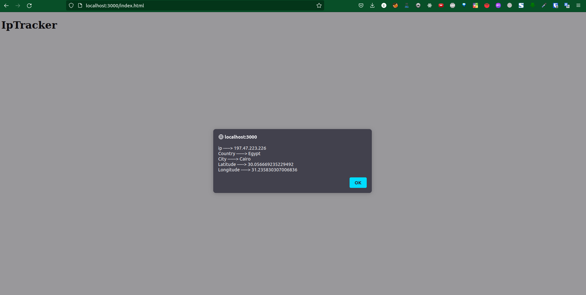
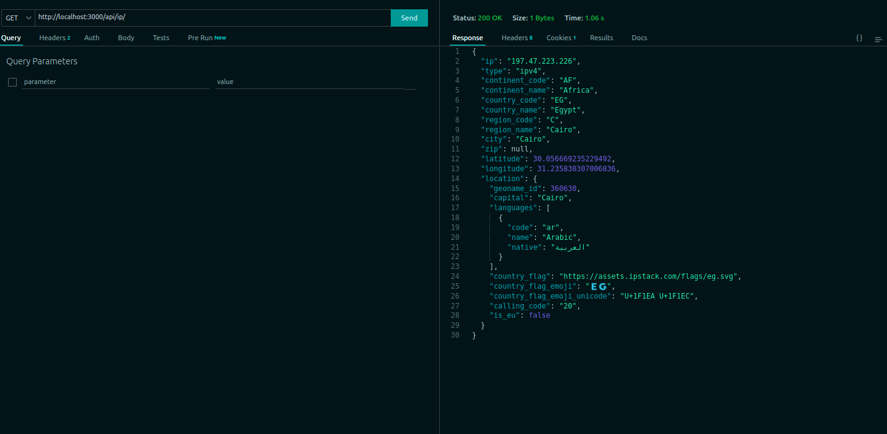

# IP Tracker

## Build And Run

- ### Task Summary
  
  * You can send request through postman, the response is json format contains all client info with a cookie in which the session id is stored in the postgres database table and this table is refrenced with client and ip data with one to one relation using seqeulize ORM.
  * You can also open browser and use url="http://localhost:3000/index.html" and this html has javascript script that send request to the localhost api and get all the current ip data and display it. 
  * Ipstack api doesn't offer os detection or user agent deteaction, so we can use [useragent npm module](https://www.npmjs.com/package/express-useragent) as a middleware.

- ### Run Server

```bash
npm install;
npm strart;
```


## Run simple Unit Testing

- it's just a simple unit testing using Jest, that test the calling api by mocking 'Axios' get request.
```bash
npm test
```

## Test Samples

- Browser
  


- Thunder client 


